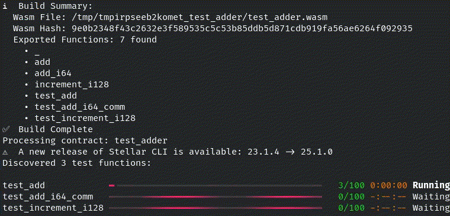

<div align="center">

# 🌠 Komet

**Formal Verification & Fuzzing for Soroban Smart Contracts**

[](https://kframework.org/install)
[](https://docs.runtimeverification.com/komet)
[](https://discord.gg/CurfmXNtbN)
[](LICENSE)

[Quick Start](#-quick-start) • [Documentation](#-documentation) • [Community](#-community)

</div>

---

## 🌟 Overview

**Komet** is a cutting-edge formal verification and fuzzing framework specifically designed for [Soroban](https://stellar.org/soroban) smart contracts on the Stellar blockchain. Built on Runtime Verification's powerful K Semantics framework, Komet enables developers to write property tests in Rust and verify their contracts' correctness across **all possible inputs**, not just a sample.



### Why Komet?

In the high-stakes world of decentralized finance (DeFi), a single bug can cost millions. Traditional testing only covers scenarios you think of. **Komet goes beyond** by:

- 🔍 **Fuzzing**: Automatically generating randomized test inputs to find edge cases
- ✅ **Formal Verification**: Symbolically executing contracts to prove correctness across **all** possible scenarios
- 🦀 **Rust-Native**: Write property tests in the same language as your Soroban contracts

---

## 🚀 Quick Start

### Installation

Install Komet in two simple steps using `kup`, Runtime Verification's Nix-based package manager:

```bash
# 1. Install kup package manager
bash <(curl https://kframework.org/install)

# 2. Install Komet
kup install komet

# 3. Verify installation
komet --help
```

### Your First Komet Test

```rust
#![no_std]
use soroban_sdk::{contract, contractimpl, Env};

#[contract]
pub struct AdderContract;

#[contractimpl]
impl AdderContract {
    pub fn add(env: Env, first: u32, second: u32) -> u64 {
        first as u64 + second as u64
    }
  
    pub fn test_add_i64_comm(env: Env, first: i64, second: i64) -> bool {
        let a = Self::add_i64(env.clone(), first, second);
        let b = Self::add_i64(env, second, first);
        a == b
    }
}
```

This example demonstrates a property test for commutativity.
Property tests in Komet are written directly within your contract implementation as methods with the `test_` prefix.
The `test_add_i64_comm` function takes two input values (`first` and `second`), executes the contract logic, and returns a boolean indicating whether the property holds.
Komet will explore different input combinations during fuzzing and prove the property holds for all inputs during formal verification.

Run your tests:

```bash
# Fuzzing mode
komet test

# Formal verification mode
komet prove run
```

---

## 🎯 How It Works

### Fuzzing vs. Formal Verification

| Approach | Coverage | Speed | Guarantees |
|----------|----------|-------|------------|
| **Unit Tests** | Sample inputs | Fast | Limited |
| **Fuzzing** | Random inputs | Fast | Probabilistic |
| **Formal Verification** | **All possible inputs** | Slower | **Mathematical proof** |

### The Komet Advantage

Fuzzing is a powerful upgrade from unit testing—it automatically explores thousands of randomized inputs to uncover edge cases quickly. However, traditional fuzzing struggles with complex nested conditions and may miss critical edge cases. **Komet's symbolic execution** systematically explores all feasible code paths using symbolic variables, providing:

- ✅ Comprehensive path coverage
- ✅ Automatic postcondition verification
- ✅ Guaranteed correctness proofs
- ✅ Detection of subtle logical errors

Fuzzing mode provides fast feedback during active development, helping catch bugs quickly as you write code, while prove mode ensures complete correctness before deployment by verifying all possible execution paths.

---

## 📚 Documentation

- **[Official Documentation](https://docs.runtimeverification.com/komet)** - Complete guides and API reference
- **[Komet Example Tutorial](https://docs.runtimeverification.com/komet/guides/komet-example)** - Step-by-step walkthrough
- **[Cheat Functions](https://docs.runtimeverification.com/komet/guides/cheat-functions)** - Advanced testing utilities
- **[Video Demo](https://www.youtube.com/watch?v=76VD0aKPXGE)** - Real-world fxDAO contract verification

---

## 🏗️ Technical Architecture

Komet is built on a solid foundation of formal methods:

- **K Semantics Framework**: Industry-standard formal semantics and verification technology
- **KWasm**: WebAssembly semantics for precise execution modeling
- **Rust Integration**: Native toolchain compatibility
- **Soroban SDK**: First-class support for Stellar smart contracts

---

## 🤝 Community

Join the Komet community and get help from experts:

- 💬 **[Discord](https://discord.gg/CurfmXNtbN)** - Chat with the team and other developers
- 🌐 **[Homepage](https://komet.runtimeverification.com)** - Latest news and updates
- 📖 **[Resources](https://docs.runtimeverification.com/komet/learn-more/resources)** - Additional learning materials
- 🐛 **[Issues](../../issues)** - Report bugs or request features

---

## 🛠️ Development Status

Komet is actively maintained by [Runtime Verification](https://runtimeverification.com), a leader in formal verification technology. We're continuously improving the tool based on community feedback and real-world usage.

### Roadmap

- Advanced Soroban Wasm debugger with Soroban-specific state inspection and IDE integrations
- Enhanced symbolic execution performance
- Additional cheat functions for testing
- IDE integrations and tooling improvements
- Expanded example library

---

## 📄 License

Komet is released under the BSD-3-Clause License. See [LICENSE](LICENSE) for details.

---

## 🙏 Acknowledgments

Built with ❤️ by [Runtime Verification](https://runtimeverification.com)

Special thanks to the Stellar Foundation and the Soroban developer community for their support and feedback.

---

<div align="center">

**[Get Started Now](https://docs.runtimeverification.com/komet)** | **[Join Discord](https://discord.gg/CurfmXNtbN)** | **[Report Issues](../../issues)**

Made with the K Framework | Securing the Future of Smart Contracts

</div>
